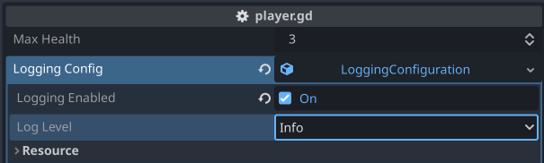

### Setup

Add to script where you want to enable logging

```gdscript
@export var logging_config: LoggingConfiguration

@onready var logger: Logger = Logger.new(logging_config)
```

Create a new LoggingConfiguration in the editor


Configure Logging Level and set enabled/disabled as required



Log messages as desired

```gdscript
logger.debug("This is a debug message")
logger.info("This is an info message")
logger.warning("This is a warning message")
logger.error("This is an error message")
```
```
2024-06-07 11:18:00 [DEBUG  ]: This is a debug message 
2024-06-07 11:18:00 [INFO   ]: This is an info message 
2024-06-07 11:18:00 [WARNING]: This is a warning message 
2024-06-07 11:18:00 [ERROR  ]: This is an error message
```

### Add additional context variables to output
```gdscript
logger.debug("This is a debug message", {"context_variable": "value"})
logger.debug("Player Spawned", {"MaxHealth": 100, "PlayerSpeed": 300})
```
```
2024-06-07 11:20:34 [DEBUG  ]: This is a debug message  | context_variable=value
2024-06-07 11:20:34 [DEBUG  ]: Player Spawned  | MaxHealth=100 PlayerSpeed=300
```